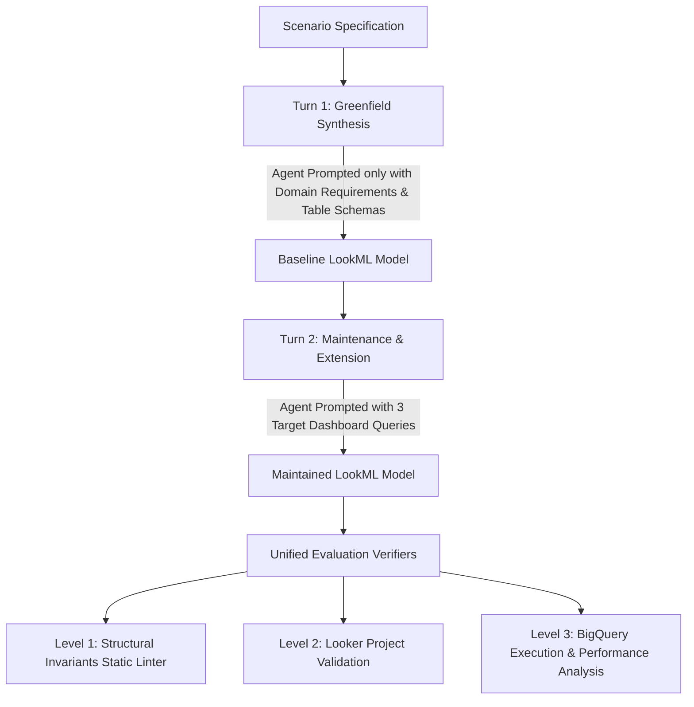

# ojof-gym

LookML patterns, benchmark tasks, and evaluation harnesses for **Outer Join On False (OJOF)** multi-fact explores.

---

## 1. Overview

In enterprise data warehouses (e.g. Google BigQuery), querying metrics across multiple fact tables of disparate grains (such as line-item sales orders, warehouse inventory stock, and website clickstream sessions) within a single Looker Explore often leads to severe data inaccuracies:
* **Cartesian Fanouts & Chasm Traps:** Joining one-to-many fact tables through shared dimensions creates row multiplication, causing inflated aggregations and requiring heavy symmetric aggregates.
* **Grain Imbalance:** Standard single-base table models bias calculations toward the base grain, making cross-domain ratios difficult to maintain.

The **Outer Join On False (OJOF)** architecture solves this by:
1. Using a **0-row base view** (`from: none` or `SELECT NULL FROM UNNEST([])`).
2. Joining fact tables via **`type: full_outer`** and **`sql_on: FALSE`** to keep fact streams isolated.
3. Joining shared dimensions dynamically using **Liquid `_in_query`** coalescing conditions to prune unneeded joins.
4. Defining cross-fact composite metrics using bare joins or composite view extensions.

**`ojof-gym`** is the standardized benchmarking harness used to evaluate AI agents and data developers on their ability to build, maintain, and refactor production-grade OJOF LookML models.

---

## 2. Evaluation Methodology: 2-Turn Lifecycle

To measure true architectural flexibility rather than rote query memorization, benchmarks run across a **two-turn evaluation protocol**:



1. **Turn 1 (Greenfield Architecture Synthesis):**
   The agent is given the high-level business goals and dataset table schemas (`bigquery-public-data.thelook_ecommerce`), but **no target user queries**.
2. **Turn 2 (Maintenance & Refactoring Protocol):**
   The agent is given concrete business dashboard queries and asked to extend its baseline model.
3. **Refactoring Friction Measurement:**
   The harness tracks line additions, deletions, code churn, and blast radius (number of modified files) between turns. Well-structured models require small additive changes (+40 lines) with zero architectural rework, whereas rigid models suffer high refactoring friction (+80 lines with explore rewrites).

---

## 3. Three-Tier Verification Engine

Every evaluation run validates candidate models against three rigorous verification tiers:

| Tier | Verifier | Description |
| :--- | :--- | :--- |
| **Level 1** | **Structural Invariant Linter** | Pattern and regex-based static analysis auditing 0-row base tables, `full_outer` / `sql_on: FALSE` fact joins, and Liquid `_in_query` coalescing logic. |
| **Level 2** | **Looker Project Validator** | Deploys candidate files to a Looker development workspace via `looker-cli` and runs full schema, graph, and model validation (0 syntax or reference errors). |
| **Level 3** | **SQL Compilation & BigQuery Execution** | Compiles dashboard queries to SQL, validates column participation, and runs queries live against BigQuery (measuring latency, row counts, bytes scanned, bytes shuffled, and spill to disk). |

---

## 4. Quick Start & Command Catalogue

A universal `./run` task runner script is provided in the repository root (similar to `npm run` in Node.js projects):

```bash
# Display help and all available commands
./run help
```

| Task / Workflow | Fast `./run` Command | Direct Python Command | Description |
| :--- | :--- | :--- | :--- |
| **Run E2E Benchmark** | `./run eval` | `python3 eval/run_benchmark.py --execute` | Runs full 2-turn benchmark across all tasks |
| **Run Single Task (TheLook)** | `./run eval:thelook` | `python3 eval/run_benchmark.py --task task_thelook_ecommerce --execute` | Evaluates `task_thelook_ecommerce` |
| **Dry Run Benchmark** | `./run eval:dry` | `python3 eval/run_benchmark.py --task task_thelook_ecommerce` | Validates task compilation without spending LLM tokens |
| **Rebuild Reports (Fast)** | `./run report` | `python3 eval/rebuild_report.py` | Re-evaluates verifiers & rebuilds reports from saved artifacts |
| **Offline Report Rebuild** | `./run report:offline` | `python3 eval/rebuild_report.py --no-looker` | Instant report formatting without Looker API calls (<1s) |
| **Run Structural Linter** | `./run lint` | `python3 verifiers/ojof_linter.py .` | Audits LookML directory against OJOF invariants |
| **Looker CLI Login** | `./run looker:login` | `~/.local/bin/with-looker looker-cli session login` | Refreshes Looker API access session |

---

## 5. Fast Iterations from Persisted Run Exports

All agent outputs and generated LookML files are automatically persisted on disk in `eval_exports/run_<timestamp>/`.

To refine verifiers, adjust presentation, or re-run queries **without re-running the slow LLM agent**:

```bash
# Re-evaluates saved LookML against Looker & BigQuery and updates reports (~5s):
./run report

# Or specify a particular historical run directory:
./run report eval_exports/run_20260829_001115

# Instant offline report generation (<1s):
./run report:offline
```

---

## 6. Generated Run Artifacts Bundle

Each benchmark run generates a self-contained export bundle under `eval_exports/run_<timestamp>/<task_id>/`:

```text
eval_exports/run_20260829_001115/task_thelook_ecommerce/
├── eval_report.md                                   # Comprehensive Side-by-Side Markdown Report
├── with_skill/
│   ├── turn1_baseline_lookml/                       # 12 Baseline LookML files from Turn 1
│   ├── turn2_maintained_lookml/                     # 12 Maintained LookML files from Turn 2
│   ├── model_refactoring.diff                       # Unified diff between Turn 1 & Turn 2
│   └── queries/
│       ├── salesRevenueVsInventoryCostByCategory_query.json
│       ├── salesRevenueVsInventoryCostByCategory_compiled.sql
│       ├── salesRevenueVsInventoryCostByCategory_sample_data.json
│       ├── salesRevenueVsInventoryCostByCategory_sample_data.csv (50 rows)
│       └── ... (for all target queries)
└── no_skill/
    ├── turn1_baseline_lookml/                       # 9 Baseline LookML files from Turn 1
    ├── turn2_maintained_lookml/                     # 9 Maintained LookML files from Turn 2
    ├── model_refactoring.diff                       # Unified diff between Turn 1 & Turn 2
    └── queries/
        └── ... (query definitions, compiled SQL, 50-row CSV/JSON sample data)
```

---

## 7. Environment & Credentials Configuration

### A. BigQuery Credentials (Application Default Credentials)
```bash
export GOOGLE_CLOUD_PROJECT="<YOUR_GCP_PROJECT>"
gcloud auth application-default login
```

### B. Looker API Configuration
Configure `.env` or standard `looker-cli` profile (`~/.config/looker-cli/config.yaml`):
```env
LOOKER_BASE_URL=https://your-looker-instance.cloud.looker.com
LOOKER_CLIENT_ID=your_client_id
LOOKER_CLIENT_SECRET=your_client_secret
LOOKER_PROJECT=lookml_sandbox
LOOKER_CONNECTION=default_bigquery_connection
```
